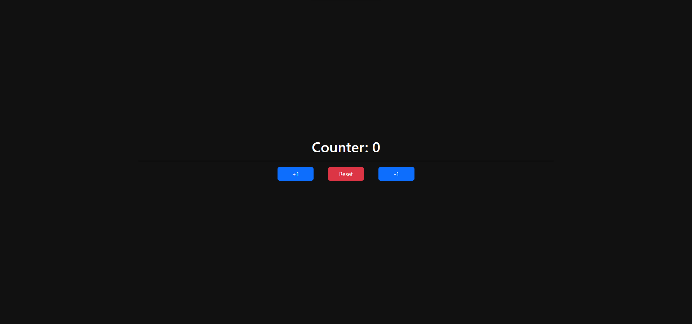

## Application
 

## Description
This is a simple Counter App, which uses a Custom Hook to make the addition and a Component to show the buttons and text that conform the interface.

## Information
- Hooks allow us to use an state and other aspects of React without creating a class
- Custom Hooks are a mechanism to reuse stateful login (such as remembering the current value)

This project was initialized with React + Vite.